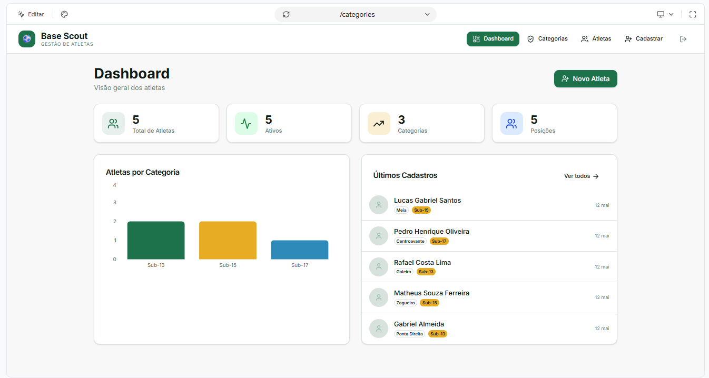
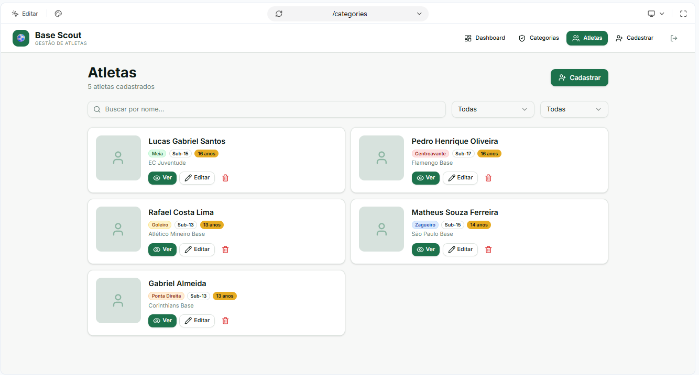
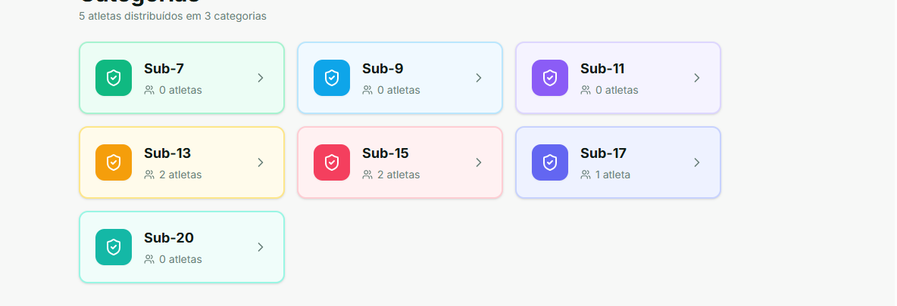
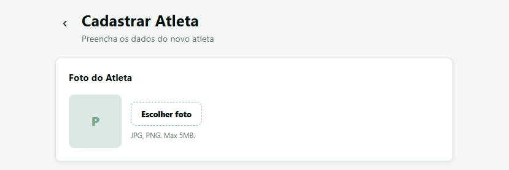
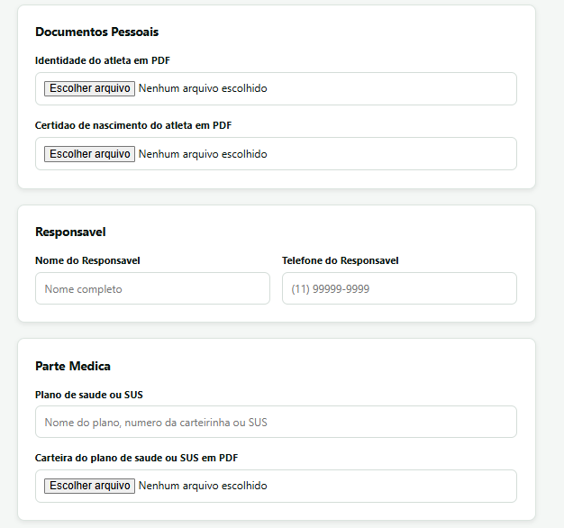
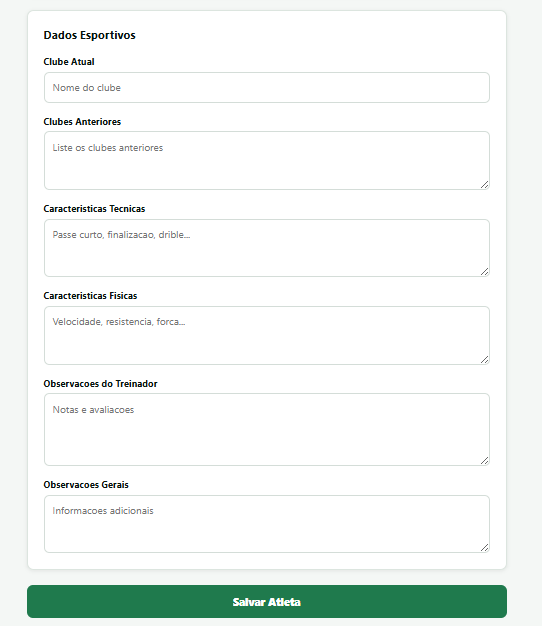
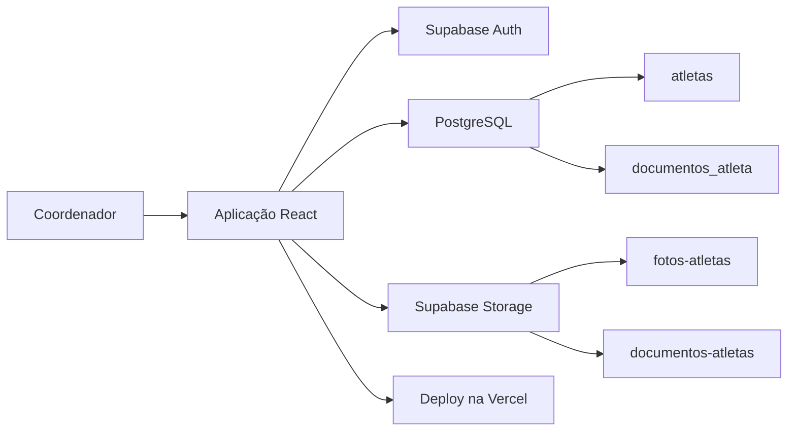

# Base Scout

Sistema web responsivo para cadastro e acompanhamento de atletas, desenvolvido para substituir fichas, documentos dispersos e controles manuais por uma operação centralizada e acessível também pelo celular.

[](https://react.dev/)
[](https://supabase.com/)
[](https://base-scout-sigma.vercel.app)
[](https://base-scout-sigma.vercel.app)

> Projeto desenvolvido para uma necessidade real, com autenticação, persistência em nuvem, upload de documentos e publicação em produção.

## Demonstração

**Aplicação publicada:** [base-scout-sigma.vercel.app](https://base-scout-sigma.vercel.app)



<p align="center">
  
  
</p>

## Principais funcionalidades

- Autenticação com e-mail e senha pelo Supabase Auth.
- Recuperação e atualização de senha.
- Cadastro, edição, consulta e exclusão de atletas.
- Busca por nome e filtros por categoria.
- Upload de fotos para o Supabase Storage.
- Upload, visualização e exclusão de documentos PDF.
- Organização de documentos por atleta.
- Interface responsiva com foco no uso em celular.
- PWA instalável no Android e iPhone.
- Deploy contínuo na Vercel.

## Fluxo de cadastro

<p align="center">
  
  
  
</p>

## Arquitetura



## Tecnologias

- React 19 e Vite
- JavaScript
- HTML e CSS responsivo
- Supabase Auth
- PostgreSQL via Supabase
- Supabase Storage
- PWA / Service Worker
- Vercel

## Segurança

- A aplicação utiliza somente a chave pública do Supabase no frontend.
- Senhas são gerenciadas pelo Supabase Auth.
- Chaves administrativas, senhas de banco e `service_role` não são expostas no cliente.
- Arquivos de ambiente locais não são versionados.

## Executando localmente

```bash
git clone https://github.com/CorreaVictorHugo/base-scout.git
cd base-scout
npm install
```

Crie um arquivo `.env.local`:

```env
VITE_SUPABASE_URL=https://seu-projeto.supabase.co
VITE_SUPABASE_PUBLISHABLE_KEY=sua_publishable_key
```

Inicie o ambiente de desenvolvimento:

```bash
npm run dev
```

## O que este projeto demonstra

- Evolução de um protótipo para uma aplicação publicada.
- Integração de frontend com autenticação, banco e armazenamento em nuvem.
- Modelagem de cadastros e documentos relacionados.
- Construção de fluxos CRUD para uma operação real.
- Cuidados com responsividade, usabilidade e segurança de credenciais.

## Autor

Desenvolvido por **Victor Hugo Nunes Corrêa**.

[GitHub](https://github.com/CorreaVictorHugo) · [Portfólio](https://victor-hugo-correa.vercel.app)
